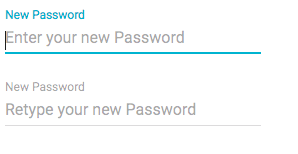

# Form [Repo](https://github.com/React-Quiver/Form)

Form written with React.

## Getting started
```
npm install
npm start
```

## Description
Advanced material-ui form generator.




## Documentation
Check the complete documentation and working example in React-Quiver doc website.
